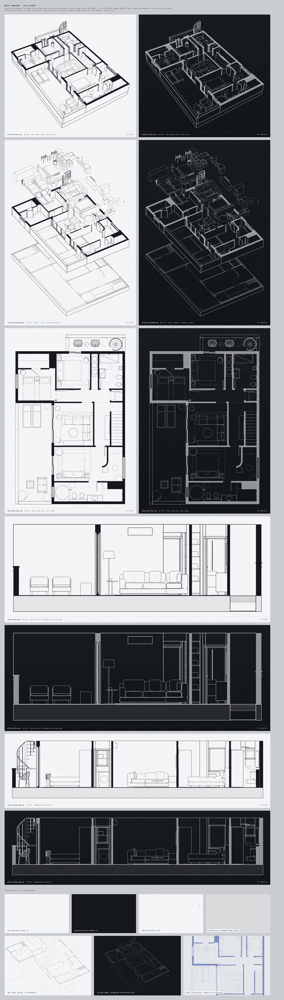

# Deco linework: vector drawings of the demo villa

Reusable, lightweight SVG line drawings generated straight from the Blender scene (`villa_renders.blend`), for
backgrounds, chapter dividers and overlays. Stroke only, `currentColor`, no raster, no brand. Everything is in
`public/assets/deco/` (served at `/assets/deco/...`), the generator is in `source/villa3d/blender/deco/`, and
`board.png` (this folder) shows all of it on paper and on graphite.



## Files

| File | What it is | Bytes | gzip | viewBox |
|---|---|---:|---:|---|
| `villa-iso-lines.svg` | Isometric/perspective outline from the hero camera (`CAM_villa_maqueta_iso`, 50 mm), walls cut at 1.15 m, furniture outlines, hidden lines removed. **Registered to the hero render** (see below). | 31,225 | 13,042 | 1729 x 1564 |
| `villa-plan-lines.svg` | Top-down plan: wall poché, furniture outlines, door swing arcs, foliage symbols, stair, glazing. | 71,815 | 22,052 | 1402 x 2143 |
| `villa-section.svg` | Section A-A: E-W cut at y = 6.55 m looking north, through the terrace, the sliding doors and the salon. Walls at full height (2.60 m), everything beyond the plane in elevation. | 15,114 | 4,207 | 1402 x 508 |
| `villa-section-long.svg` | Section B-B: N-S cut at x = 5.00 m looking east (long axis of the plan: bedrooms, bathrooms, laundry, spiral stair). Same drawing rules. | 33,655 | 10,289 | 2139 x 508 |
| `villa-axo-exploded.svg` | Exploded axonometric of the three layers used by the despiece (floors, walls, furniture), same azimuth/elevation as the hero (212 deg / 42 deg), orthographic, with dashed vertical guides at the plinth corners. Layers are lifted 6.6 m and 12.4 m. | 50,388 | 19,172 | 1473 x 2114 |
| `paper-grain.png` | 256 x 256 tileable speckle, palette PNG with alpha (transparent + faint white + faint black). Works on paper and on graphite with no blend mode. | 5,766 | n/a | 256 x 256 |
| `hatch-45.svg` | 8 x 8 tile of a 45 degree architectural hatch (`currentColor`). | 232 | 187 | 8 x 8 |

All drawings are under the 80 KB budget, coordinates are integers or one decimal, paths are relative
polylines, and there are no fills except the `#poche` group (and none at all in `hatch-45.svg`).
`python source/villa3d/blender/deco/verify_svgs.py` checks all of this.

## Structure of a drawing (one `<g>` per line weight, so CSS can restyle any layer)

Root: `fill="none" stroke="currentColor" stroke-linecap="round" stroke-linejoin="round"`. Stroke widths are in
viewBox units and are presentation attributes, so any CSS rule overrides them.

| Group `id` | Content | Width iso / plan | Opacity |
|---|---|---|---|
| `poche` | **fill** `currentColor`: wall section caps at the 1.15 m cut (sections: cut walls, frames, slabs) | fill | 1 |
| `walls` | wall, partition and parapet volumes | 2.8 / 1.8 | 1 |
| `plinth` | maqueta base block | 2.5 / 1.6 | 1 |
| `openings` | window and door frames, sills, copings | 2.0 / 1.3 | 1 |
| `glass` | glazing outlines (glass never hides lines behind it) | 1.1 / 0.7 | .6 |
| `stairs` | spiral stair, steps | 1.7 / 1.1 | .85 |
| `furniture` | furniture and fittings | 1.55 / 1.0 | .85 |
| `plants` | foliage silhouettes (smoothed) | 1.4 / 0.9 | .75 |
| `floors` | floor finish boundaries | 1.2 / 0.8 | .6 |
| `fine` | rugs, Acapulco chair cords, small detail | 1.1 / 0.7 | .55 |
| `swings` (plan) | door swing arcs | 0.7 | .55 |
| `footprints`, `footprint-hatch`, `guides` (axo) | wall footprint on the floor layer, its 45 degree hatch, dashed vertical guides | .84 / .84 / .96 | .5 / .5 / .55 |
| `hatch`, `cut-ground`, `cut-furniture` (sections) | 45 degree hatch of the ground block, its outline, outlines of cut furniture | .7 / 1.6 / 1.2 | .5 / 1 / 1 |

The axo uses 1.2x the plan weights, the sections use the plan weights (the iso is 1.55x because it is drawn at
hero-pixel scale).

## How to use them

Only the SVG **inlined** in the page inherits `currentColor`. As `` or as a CSS image the strokes are black.
Three recipes, all allowed by the site CSP (`img-src 'self' data: blob:`, `style-src 'self' 'unsafe-inline'`):

```css
/* 1. Background, any colour, cached, no HTML weight: CSS mask. Group opacities survive as mask alpha. */
.deco-plan {
  position: absolute; inset: 0; pointer-events: none;
  background: currentColor; color: var(--ink);            /* or #E4E7EA on graphite */
  opacity: .10;
  -webkit-mask: url(/assets/deco/villa-plan-lines.svg) right -6% top 8% / auto 115% no-repeat;
          mask: url(/assets/deco/villa-plan-lines.svg) right -6% top 8% / auto 115% no-repeat;
}

/* 2. Watermark with an : black strokes, tone it with opacity (on graphite add filter: invert(1)). */
img.deco { opacity: .12; }

/* 3. Inline (paste the file): full control per group, hairlines that never scale. */
.deco { color: #E4E7EA; }
.deco #poche { opacity: .6; }                              /* the poché is too loud on dark: dim it */
.deco path   { vector-effect: non-scaling-stroke; stroke-width: 1px; }   /* constant 1 px hairlines */
.deco #walls, .deco #plinth { stroke-width: 1.6px; }
```

Textures:

```css
.grain::after { content: ""; position: absolute; inset: 0; pointer-events: none;
  background: url(/assets/deco/paper-grain.png) 0 0 / 256px 256px; }        /* ~5.6 KB, tiles seamlessly */
.hatched { background: currentColor;
  -webkit-mask: url(/assets/deco/hatch-45.svg) 0 0 / 8px 8px;
          mask: url(/assets/deco/hatch-45.svg) 0 0 / 8px 8px; }             /* any colour, repeat is the default */
```

Guidance measured on `board.png`:
- On paper (`#F4F5F6`) use ink `#14171B`; on graphite use `#E4E7EA` with `#poche` at .5 to .6. At background strength
  (opacity .06 to .15) the poché becomes a soft tonal mass and the thin groups turn into a fine grid, which is the
  intended texture. The añil accent `#2D4596` works well as a mask colour at .5 on the stage grey (last demo on the board).
- Cropping is the point: use a 120 to 200% tall mask and let the container cut the drawing, do not show it whole.
- Do not animate the whole plan with `stroke-dashoffset` (about 2,000 sub-paths). Animate opacity or transform of the
  container, or reveal by `clip-path` / `mask-position`.
- Suggested homes: iso = hero and process backdrop; plan = large low-contrast field behind a dark chapter; the two
  sections = full-bleed strips between chapters or above the footer; axo = the process page, next to the despiece.

### Where the drawings are used on the site (rulebook O3 and O3.1)

All as CSS masks tinted by the ink of the chapter (`background: var(--color-ink)` + `mask`), so they work on white, paper, grey and graphite and in both themes; none is in the HTML.

| Drawing | Where |
|---|---|
| `villa-plan-lines.svg` | Hero watermark of the home and of the audience, about, glossary, case, 404 and AR pages (rotated, from 1024 px); side drawing beside the step lists of a page (`data-d="plan"`) |
| `villa-iso-lines.svg` | Hero watermark of the service, hub and contact pages; side drawing of the second step list of a page |
| `villa-axo-exploded.svg` | Home process chapter (faint, behind the steps); sticky side drawing of every `process` list on the inner pages (white on graphite); hero watermark of the process and guide pages |
| `villa-section.svg` | Hero watermark of the zone, pricing, FAQ, thanks and legal pages (a horizon line low in the sheet) |
| `villa-section-long.svg` | The «Sección A-A'» strip above every footer |
| `paper-grain.png` | Graphite chapters, the cinema chapters and their scrims |
| `hatch-45.svg` | Not used as a file: the section-cut hatch is a `repeating-linear-gradient` (strip top edge, callouts, section heads of a guide) |

### Registered to the hero render

`villa-iso-lines.svg` uses the exact pixel space of `villa_maqueta_iso.png` (2800 x 1800), cropped to the drawing.
The crop is written on the root: `data-hero-crop="564 77 1729 1564" data-hero-size="2800 1800"`. To overlay it on the
hero image, position it inside the hero box at `left: 20.14%; top: 4.28%; width: 61.75%; height: 86.89%`. It was
checked by compositing the two: sofa, tables, wall tops, glazing and terrace edges land on the render's edges to the
pixel (the projection is validated against Blender's `world_to_camera_view`, worst error 0.0001 px on every run).
That allows a render-to-linework crossfade, or drawing the lines in over the render.

## How they were made

Blender's Freestyle SVG exporter is not bundled with 5.2 and Freestyle works per pixel, so the edges are projected
and hidden-line tested by our own code. Two stages:

**A. Blender, headless (`deco_lib.py`, `extract_views.py`, about 30 s for all views).** Reads the saved scene only.
1. Objects are classified with the same split as `villa_despiece.py` (floors / walls / everything else) plus
   weight classes (structure, openings, glass, stairs, furniture, plants, small detail). Small hardware (handles,
   joints, books, flowers, skirting) is dropped.
2. Vertices are welded by position (the glTF importer duplicates them at UV seams). Feature edges are borders, creases
   (25 deg for structure, 35 deg for furniture) and view-dependent silhouettes. An edge shared by touching boxes
   cancels its internal back-to-back faces, which removes the false seams between adjacent boxes of the plinth.
   Silhouettes count a face that is edge-on (an exactly vertical side seen from above) as not front-facing.
3. Hidden lines: every edge is sampled about every 8 to 12 units and ray cast to the eye against a BVH of the visible
   triangles (1.2 cm tolerance); visible/hidden transitions are refined by bisection, so line ends are exact. Glass
   is transparent, plants are solid convex hulls (scaled 0.9) so foliage hides what is behind it as a soft body.
4. Poché: wall section caps (`Corte_Seccion`) are cut into rectangles and tested along their centre line exactly
   like edges, so a wall strip under a floating furniture layer is cut where the furniture hides it.
5. Sections: triangles are clipped at the plane, the plane/mesh intersection gives the cut segments, and lines
   beyond the plane are hidden-line tested against the clipped model (seam edges at the 1.15 m split are dropped).
6. Exploded axo: the three despiece layers are lifted in Z and the assembly is tested as one scene, so upper layers
   occlude lower ones physically; wall footprints are projected on the floor layer (the plan on the slab).

**B. System Python + shapely (`build_svg.py`, about 20 s).** Segments are snapped, noded and de-duplicated, chained
into polylines, simplified (Douglas-Peucker, 0.28 to 0.6 units), filtered by minimum length, and lighter layers
drop whatever a heavier layer already draws. Section cuts are polygonized into cells (poché), lines falling inside a
solid are clipped, the ground block is hatched at 45 deg. Foliage becomes a smoothed union of the visible leaf
triangles (slivers of plants hidden behind walls are dropped). Output is compact relative path data, cropped to the
drawing's bounding box.

The textures come from `make_textures.py`: `paper-grain.png` is Gaussian noise low-passed with an FFT (so the wrap
is seamless), thresholded to two strengths of white and black specks and saved as a 3-bit palette PNG with alpha.

## Regenerate

Needs Blender 5.2, Python 3 with `numpy`, `shapely` (2.x) and `Pillow`, and Node with `sharp` (already in the repo).
The `.blend` is git-ignored (rebuild it with `villa_render.py --save-blend --no-render`, see
`source/villa3d/blender/README.md`).

```powershell
cd E:\ProyectosRealStateBlender\source\villa3d\blender\deco
node regenerate.mjs                     # extract, build, textures, verify, board   (about 1 min)
node regenerate.mjs extract build       # only the drawings
node regenerate.mjs textures verify     # only the textures and the check
# env: BLENDER (path to blender.exe), PYTHON

# by hand, one view:
& "C:\Program Files\Blender Foundation\Blender 5.2\blender.exe" -b --factory-startup ..\villa_renders.blend -P extract_views.py -- --views plan
python build_svg.py plan
node preview.mjs ..\..\..\..\public\assets\deco\villa-plan-lines.svg $env:TEMP\plan.png --w 1800 --bg "#F4F5F6" --ink "#14171B"
```

Knobs: `extract_views.py --section-y 6.55 --section-x 5.0 --dz2 6.6 --dz3 12.4` (section planes, axo lift);
`deco_lib.classify` (what is dropped, crease angles, weight classes); `build_svg.CFG` (weights, tolerance,
minimum lengths, foliage radius). Intermediates go to `deco/_cache/` (git-ignored); `probe_scene.py` lists
collections, cameras and object classes of the scene.

## Limits

- It draws the modelled geometry only: floor tile joints and the wood grain are textures in the renders, so they are
  not in the linework. Furniture is the demo set; if the model changes, rerun.
- The section planes (A-A at y = 6.55 m, B-B at x = 5.00 m) were picked to pass through the terrace/salon and the
  long axis; both are arguments. Cut furniture is outlined, not filled; only structure gets poché.
- Foliage is a symbol (smoothed silhouette), not leaf detail. Door swings are computed from the modelled leaf and frame
  (7 doors in the plan); the leaf itself is also drawn open, as modelled.
