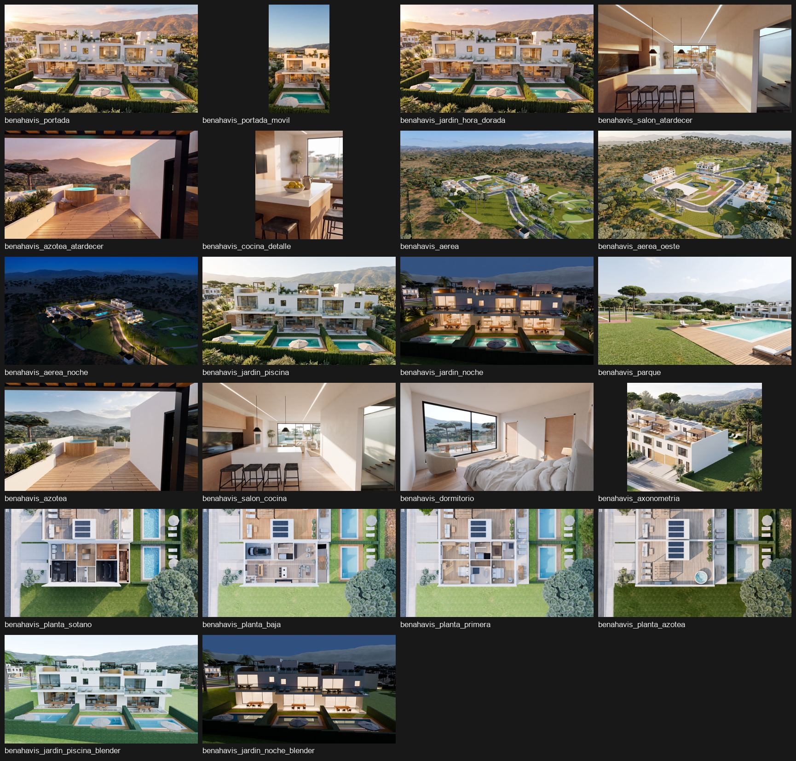

# Kit de imágenes del Residencial Benahavís (10 oct 2026)

22 imágenes ya preparadas para la web: elegidas, con el color igualado y generadas con `npm run images` (AVIF/WebP en `public/assets/img/` y entradas en `build/generated/images.json`). **No hay que convertir nada**: basta con usar las claves.

## Criterio

El Residencial Benahavís es un **proyecto de demostración** (ficticio). En la web manda la mejor calidad visual, no la fidelidad al proyecto: si la IA añade detalles que se ven mejor (por ejemplo, la piedra de la planta baja), se quedan. Lo que no cambia es el pie: siempre dice «proyecto de demostración» y si la imagen es de IA o un render 3D.

## Claves y uso sugerido

| Clave | Qué es | Tamaño | Uso sugerido | Tipo |
|---|---|---|---|---|
| `benahavis_portada` | Las tres casas con piscina a la hora dorada | 2400×1340 | **Portada, escritorio** (elegida por Álvaro) | IA |
| `benahavis_portada_movil` | Una casa con su piscina, vertical, cielo limpio arriba para el titular | 1350×2419 | **Portada, móvil** (elegida por Álvaro) | IA |
| `benahavis_jardin_hora_dorada` | Variante de la portada, luz más suave y cielo rosado | 2400×1340 | Proyectos, redes o cierre | IA |
| `benahavis_salon_atardecer` | Salón y cocina al atardecer | 2400×1340 | Entregables (imágenes) | IA |
| `benahavis_azotea_atardecer` | Azotea con jacuzzi al atardecer | 2400×1340 | Proyectos o banda de ambiente | IA |
| `benahavis_cocina_detalle` | Detalle de la isla de cocina, vertical 4:5 | 1600×1986 | Pieza vertical para romper el ritmo | IA |
| `benahavis_aerea` | Vista aérea de la urbanización | 2400×1340 | Proyectos (tarjeta de Benahavís) | IA |
| `benahavis_aerea_oeste` | Vista aérea desde el oeste | 2400×1340 | Alternativa a la anterior | IA |
| `benahavis_aerea_noche` | Vista aérea de noche | 2400×1340 | Día y noche | IA |
| `benahavis_jardin_piscina` | Jardín con las tres piscinas, de día | 2400×1340 | Comparador render / imagen final | IA |
| `benahavis_jardin_noche` | Jardín de noche | 2400×1340 | Día y noche | IA |
| `benahavis_parque` | Parque central con piscina comunitaria | 2400×1340 | Zonas comunes | IA |
| `benahavis_azotea` | Azotea de día | 2400×1340 | Estancias | IA |
| `benahavis_salon_cocina` | Salón y cocina de día | 2400×1340 | Estancias | IA |
| `benahavis_dormitorio` | Dormitorio principal | 2400×1340 | Estancias | IA |
| `benahavis_axonometria` | Maqueta axonométrica de la fila de casas | 2304×1856 | Entregables (maqueta 3D) | IA |
| `benahavis_planta_sotano` | Planta sótano, cenital amueblada | 2400×1340 | Entregables (planos por planta) | IA |
| `benahavis_planta_baja` | Planta baja, cenital amueblada | 2400×1340 | Entregables (planos por planta) | IA |
| `benahavis_planta_primera` | Planta primera, cenital amueblada | 2400×1340 | Entregables (planos por planta) | IA |
| `benahavis_planta_azotea` | Planta azotea, cenital amueblada | 2400×1340 | Entregables (planos por planta) | IA |
| `benahavis_jardin_piscina_blender` | Render de Blender del jardín (misma cámara que `benahavis_jardin_piscina`) | 1920×1080 | Comparador render / imagen final; día/noche | Blender |
| `benahavis_jardin_noche_blender` | Render de Blender del jardín de noche | 1920×1080 | Interruptor día/noche (fase 2) | Blender |

Las dos de portada pesan 128 KB (escritorio, 1200 px AVIF) y 97 KB (móvil, 800 px AVIF), dentro del presupuesto de LCP de 150 KB.

## Pies de foto (ES / EN)

El comprobador exige que el pie contenga la palabra «render».

- IA, ES: «Imagen retocada con IA a partir del render 3D del proyecto de demostración Residencial Benahavís.»
- IA, EN: "AI-enhanced image from the 3D render of the Residencial Benahavís demo project."
- Blender, ES: «Render 3D del proyecto de demostración Residencial Benahavís.»
- Blender, EN: "3D render of the Residencial Benahavís demo project."

## Lo que falta para usarlas (es código, lo haces tú)

1. Añade las claves que uses a la lista `IMAGES` de `build/validate-content.mjs` **y** de `build/build.mjs` (deben coincidir).
2. Alt y pie en `build/data/plates.mjs`.
3. Documenta las claves en `docs/build/CONTENT-SCHEMA.md` §6.

## Cuidado al volver a ejecutar `npm run images`

`scripts/images.mjs` reconstruye el manifiesto **solo con las PNG que haya en `source/villa3d/renders/`** y borra los AVIF/WebP de las que falten. Esas PNG no se suben a git. Antes de ejecutarlo:

1. Descarga las originales de Benahavís: [benahavis_web_maestras.zip](https://github.com/alvaroalarcon19/homeview3d-disenos/releases/tag/imagenes-benahavis-2026-10-10) (repo privado `homeview3d-disenos`, acepta la invitación) y copia las 22 PNG a `source/villa3d/renders/`.
2. Ten también las PNG de la villa. Si no las tienes, el script borrará sus imágenes: después ejecuta `git checkout -- public/assets/img` y vuelve a añadir sus entradas al manifiesto desde `git show HEAD:build/generated/images.json` (es lo que se hizo en este PR para no tocar la villa).

## De dónde salen

- Las 6 nuevas (`portada`, `portada_movil`, `jardin_hora_dorada`, `salon_atardecer`, `azotea_atardecer`, `cocina_detalle`): Nano Banana Pro en 4K, 10 oct 2026, con las imágenes anteriores como referencia. Al salón se le bajó el naranja y a la de móvil se le dio un punto más de calidez para casar con la portada.
- Las demás: Nano Banana Pro a partir de los renders de Blender del modelo 3D (7 oct 2026), y los dos renders de Blender tal cual.
- Originales en 4K y el registro de trabajos: `ComunidadBenahavis/imagenes/renders_ia_portada/` y `renders_ia_modelo3d/` (copias de Álvaro).
